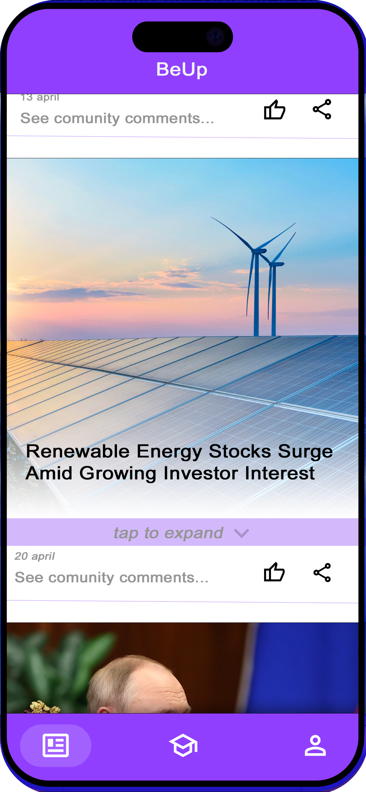
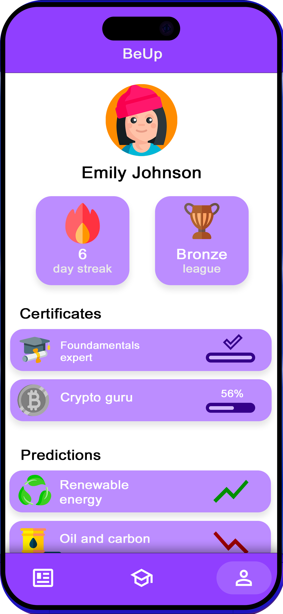

# BeUp

## Introduction
BeUp represents a paradigm shift in financial education, harnessing the power of Artificial Intelligence to deliver personalized and interactive learning experiences. With a focus on responsible education, it empowers users to analyze global news and understand its financial impact. Through dynamic content and real-world examples, BeUp cultivates financial literacy and equips users with the knowledge to make informed decisions about their finances, promoting long-term financial well-being.

## Key Features
1. **Personalized Learning:** BeUp leverages AI technology to tailor learning experiences to each user's individual needs and preferences. Through adaptive learning algorithms, the platform identifies areas for improvement and delivers customized content to help users strengthen their financial knowledge.

2. **Real-Time News Learning:** Stay updated with real-time financial news tailored to your level of understanding, curated by AI. Learn from current events and trends, with quizzes to reinforce your knowledge.

3. **Interactive Simulations:** The application offers interactive simulations and scenarios that simulate real-life financial situations. Users can practice managing budgets, investing in stocks, and making strategic financial decisions in a risk-free environment, enhancing their practical skills and confidence.

4. **Data-Driven Insights:** With AI-driven analytics, EduFinance AI provides users with valuable insights into their financial habits and trends. Users can track their spending patterns, identify areas for saving, and receive personalized recommendations for optimizing their financial health.

5. **Profile and Progress Tracking:** Keep track of your learning journey with a personalized profile. Monitor your progress, achievements, and areas for improvement as you advance through the course material.

   
   

## Getting Started
To get started with BeUp, simply sign up for an account on our website or download the mobile app from the App Store or Google Play Store. Once registered, you can personalize your learning experience, explore interactive simulations, and access a wealth of educational resources to enhance your financial knowledge.
